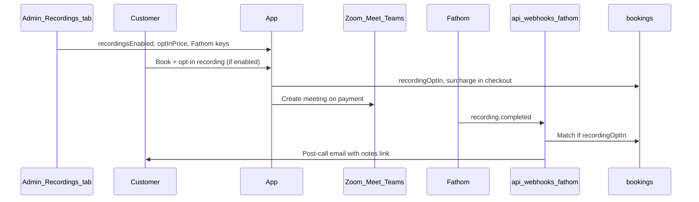

# Fathom integration for consultation recordings

## Overview

Integrate Fathom as a parallel layer on existing Zoom/Google Meet/Teams bookings: receive webhooks after calls, auto-link recordings to bookings, surface notes in admin, email customers post-call, and document one-host Fathom setup (visible notetaker, Free plan).

**Plan update:** Admin configuration moves from env-only to a new **Settings → Recordings** tab (same pattern as Payments/Meetings), with global enable/disable, customer opt-in pricing, and encrypted Fathom credentials. Checkout and booking flows respect opt-in before charging or sending notes.

## Context and constraints

Your app already provisions video meetings on paid confirmation via [`ensureVideoMeetingStoredForBooking`](apps/web/src/lib/video-meetings/ensure-video-meeting-for-booking.ts) (Zoom / Google Meet / Microsoft Teams). **Fathom does not replace that flow** — the host’s Fathom account captures calls; your app **ingests** results via [Fathom webhooks](https://developers.fathom.ai/webhooks) and the [REST API](https://developers.fathom.ai/quickstart).

Locked-in product choices:

| Decision | Choice |
|----------|--------|
| Host model | One fixed host (single Fathom user) |
| Fathom plan | Free (Public API + webhooks; note 5 advanced AI summaries/month on Free) |
| Capture | Visible notetaker bot |
| Delivery | Admin UI + customer email (only when opted in — see Recordings settings) |
| Providers | All three meeting providers (host connects all in Fathom) |
| Matching | Auto-link by time + title; manual fallback when ambiguous |
| Admin config | **Recordings** settings tab (Fathom today; extensible later) |
| Customer billing | **Opt-in** with admin-configured price (centavos); $0 = free opt-in |



---

## 1. Recordings settings (Admin tab + Mongo singleton)

### UI: new **Recordings** tab

Extend [`admin-settings-workspace.tsx`](apps/web/src/components/admin/admin-settings-workspace.tsx) following the Payments/Meetings pattern:

- Add `SettingsTab` value: `'recordings'`
- Tab label **Recordings**, icon e.g. `Clapperboard` or `Mic` from lucide
- New [`admin-recording-settings-form.tsx`](apps/web/src/components/admin/admin-recording-settings-form.tsx) with `formRef` / `onStateChange` / sticky footer save-reset
- Update page header description to mention recordings

### Domain: `recording_settings` collection

Add to [`packages/domain/src/collections.ts`](packages/domain/src/collections.ts):

- `recordingSettings: 'recording_settings'`

New types in `packages/domain/src/recording-types.ts` (or extend meeting-types):

```ts
/** Singleton `_id: 'default'` — consultation recording / notetaker configuration. */
export type RecordingSettingsDocument = {
  readonly _id: 'default';
  readonly recordingsEnabled: boolean;
  /** Surcharge when customer opts in at checkout (centavos). 0 = free opt-in. */
  readonly recordingOptInPriceCentavos: number;
  /** Active notetaker backend (only fathom for v1). */
  readonly activeProvider: 'none' | 'fathom';
  readonly providerCredentials: Partial<Record<'fathom', EncryptedCredentialBlob>>;
  readonly updatedAt: Date;
};
```

Fathom credential keys (encrypted, same pattern as [`meeting-credentials-crypto.ts`](apps/web/src/lib/server/meeting-credentials-crypto.ts) / meeting settings):

- `apiKey`
- `webhookSecret`
- `hostEmail` (fixed host for matcher sanity check)

Env **fallback** (optional, for local dev only): `FATHOM_*` vars documented in `.env.example` but **admin UI is source of truth in production**.

### Data layer

New [`apps/web/src/lib/data/recording-settings.ts`](apps/web/src/lib/data/recording-settings.ts):

- `getRecordingSettingsAdminView()` — masks secrets, `configured` flags, `canStoreCredentials`
- `getRecordingSettingsPublicView()` — `{ recordingsEnabled, recordingOptInPriceCentavos, recordingOptInPriceLabel }` (no secrets)
- `updateRecordingSettings(patch)`
- `resolveFathomCredentialsForRuntime()` — decrypt when `activeProvider === 'fathom'` and `recordingsEnabled`

### Admin API

- `GET/PATCH /api/admin/recording-settings` — mirror [`payment-settings/route.ts`](apps/web/src/app/api/admin/payment-settings/route.ts) with zod patch schema
- Optional `POST` test: call Fathom `GET /meetings?limit=1` with stored API key

### Recordings tab form sections

1. **Recording policy**
   - Toggle: **Enable consultation recordings** (`recordingsEnabled`) — master switch; when off, hide opt-in in checkout, skip webhooks processing, skip Fathom emails
   - **Opt-in price (PHP)** — `recordingOptInPriceCentavos` input (same centavos pattern as Payments checkout amount); helper text: “Customers who want AI meeting notes pay this on top of the consultation price. Set to 0 for free opt-in.”

2. **Fathom** (only provider card in v1; structure allows future providers)
   - Active provider: `none` | `fathom` (radio; only `fathom` when recordings enabled)
   - API key, webhook secret, host email fields
   - Link to [`docs/fathom-setup.md`](docs/fathom-setup.md) for Zoom/Meet/Teams + webhook URL
   - Webhook destination display: `{NEXT_PUBLIC_APP_URL}/api/webhooks/fathom`

Future providers (Zoom cloud record, etc.) = additional cards under same tab without restructuring.

---

## 2. Customer opt-in at booking / checkout

### Booking document fields

Extend [`BookingDocument`](packages/domain/src/types.ts):

```ts
recordingOptIn?: boolean;
recordingOptInPriceCentavos?: number | null;  // snapshot at booking time
fathomRecordingId?: string;
fathomShareUrl?: string;
fathomSummary?: string;
fathomActionItems?: string[];
fathomMatchStatus?: 'pending' | 'linked' | 'ambiguous' | 'unmatched' | 'manual' | 'skipped';
fathomProcessedAt?: Date;
fathomNotesEmailSentAt?: Date;
```

### Public config + UI

- Expose opt-in availability via [`payment-config`](apps/web/src/app/api/checkout/payment-config/route.ts) or dedicated public endpoint (include `recordingsEnabled`, `recordingOptInPriceLabel`, `recordingOptInPriceCentavos`)
- **Booking picker / checkout** ([`booking-picker.tsx`](apps/web/src/app/(marketing)/book/booking-picker.tsx)): when `recordingsEnabled`, show checkbox “Add AI meeting notes & recording (+₱X)” default **unchecked**
- Persist `recordingOptIn` on create-booking API body ([`apps/web/src/app/api/bookings/route.ts`](apps/web/src/app/api/bookings/route.ts))

### Checkout amount

Extend [`resolveCheckoutAmountCentavos`](apps/web/src/lib/payments/resolve-checkout-amount.ts):

- Accept optional `recordingOptIn: boolean`
- If true and settings have price > 0, add `recordingOptInPriceCentavos` to base amount (after promo/quote logic; document that quotes may need admin to include recording manually in v1, or add quote line later)
- Return breakdown fields for UI: `recordingSurchargeCentavos`, `recordingOptIn`

Pass `recordingOptIn` through [`payment-checkout.ts`](apps/web/src/lib/payments/payment-checkout.ts) and guest manage checkout so payment provider charges the total.

### Gating Fathom pipeline

| Condition | Behavior |
|-----------|----------|
| `recordingsEnabled === false` | No opt-in UI; webhook handler no-ops |
| `recordingOptIn === false` | Meeting still created; Fathom may still capture on host side but **app ignores** webhook for this booking (or sets `fathomMatchStatus: skipped`) |
| `recordingOptIn === true` | Full webhook match, admin notes, customer email |

Confirmation email: include notetaker disclosure **only when** `recordingOptIn === true` (or when recordings enabled and opt-in selected at booking).

---

## 3. Data model (webhook idempotency)

Add `fathomWebhookDeliveries` collection in [`collections.ts`](packages/domain/src/collections.ts) with unique index on `webhookId`.

---

## 4. Fathom library layer

New module `apps/web/src/lib/fathom/` (unchanged intent from prior plan):

- `verify-fathom-webhook.ts` — use webhook secret from **recording settings**, not env
- `parse-fathom-webhook-payload.ts`
- `match-fathom-recording-to-booking.ts` — dual title patterns (Zoom/Teams vs Google Meet calendar titles)
- `apply-fathom-recording-to-booking.ts`
- `fetch-fathom-recording.ts` — API key from settings
- `process-fathom-webhook.ts` — gate on `recordingsEnabled` + booking `recordingOptIn`

---

## 5. Webhook API route

[`apps/web/src/app/api/webhooks/fathom/route.ts`](apps/web/src/app/api/webhooks/fathom/route.ts) — same pattern as PayMongo webhooks.

---

## 6. Emails

- **Post-call:** [`send-booking-fathom-notes-email.ts`](apps/web/src/lib/email/send-booking-fathom-notes-email.ts) — only if `recordingOptIn && fathomShareUrl`
- **Confirmation:** notetaker disclosure when customer opted in at booking

---

## 7. Admin booking experience

- Booking detail: meeting URL + Fathom notes + `recordingOptIn` / price paid
- Manual link API: `PATCH /api/admin/bookings/[bookingId]/fathom`
- Optional unmatched webhook queue

---

## 8. Customer manage-booking UI

Extend `GuestBookingManageView` with `fathomNotesUrl` / summary preview when opted in and processed.

---

## 9. Operational doc + privacy

- [`docs/fathom-setup.md`](docs/fathom-setup.md) — reference Recordings tab for credentials
- Privacy policy paragraph for opt-in recording + Fathom processor

---

## 10. Onboarding tour (optional)

Add admin onboarding step for Recordings tab in [`admin-onboarding-page-steps.ts`](apps/web/src/lib/admin/admin-onboarding-page-steps.ts) if time permits.

---

## Out of scope (v1)

- Native app recording UI
- Full transcript storage in Mongo
- Multiple recording providers beyond Fathom config shell
- Automatic recording without customer opt-in (host-only capture still possible in Fathom app but app won’t bill or email)

---

## Implementation todos

- **recording-settings-domain**: `recording_types`, `COLLECTIONS.recordingSettings`, `RecordingSettingsDocument`, booking opt-in fields
- **recording-settings-admin**: `recording-settings.ts` data layer, GET/PATCH API, `AdminRecordingSettingsForm`, Recordings tab in workspace
- **checkout-opt-in**: Public config, booking API, checkout amount surcharge, booking picker checkbox
- **fathom-lib**: Verify, parse, match, apply (credentials from settings)
- **webhook-route**: POST `/api/webhooks/fathom` + idempotency collection
- **emails**: Post-call + conditional confirmation disclosure
- **admin-booking-ui**: Notes section, manual link, opt-in display
- **customer-manage**: Guest manage view + api-client
- **docs-privacy**: `docs/fathom-setup.md` + privacy copy
